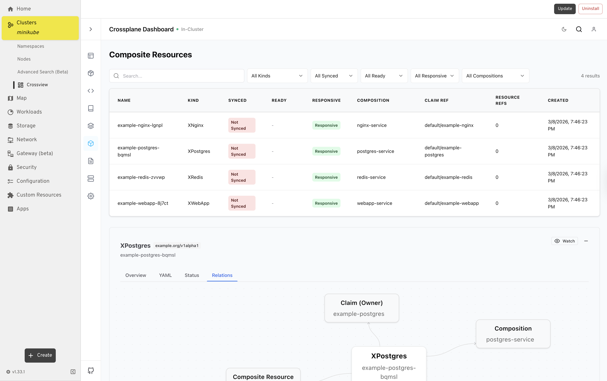

# Crossview Headlamp Plugin

Crossview Headlamp Plugin adds a dedicated `Crossview` page in Headlamp so users can install, update, uninstall, and open Crossview directly from the cluster UI.

Crossview project repository:

- https://github.com/crossplane-contrib/crossview

## Screenshot

